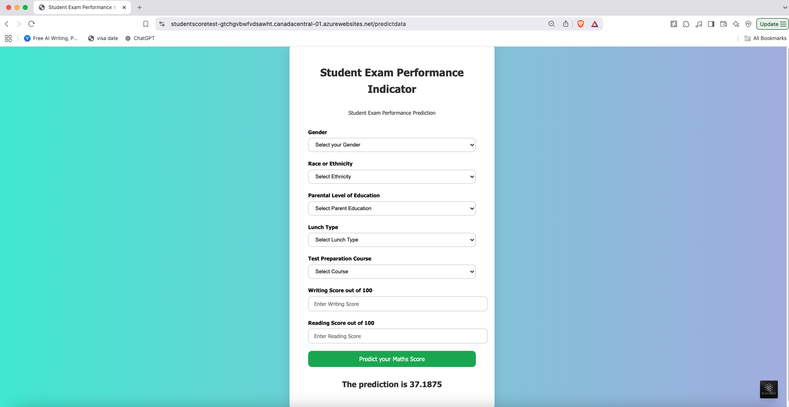

# 📊 ML OPS Maths Score Predictor

This project predicts student math scores using a complete ML pipeline with MLflow tracking, Docker containerization, and deployment on Azure App Services. It demonstrates MLOps best practices, including experiment tracking, model packaging, and CI/CD integration for robust real-world deployment.

🔗 **Live App**: <a href="https://studentscoretest-gtchgvbwfvdsawht.canadacentral-01.azurewebsites.net/predictdata_blank" target="_blank">Click to Predict</a>

### 🖼️ Live App Screenshot

---

## 🚀 Project Overview

- Built a regression model to predict student math performance based on demographic and academic features.
- Implemented MLflow for experiment tracking and reproducibility.
- Containerized the app using Docker for portable deployment.
- Deployed the model as a web app using Azure App Services.
- Achieved a **20% improvement** in prediction reliability across evaluation metrics.

---

## 🧠 Technologies Used

- **Python**
- **Pandas, Scikit-Learn**
- **MLflow** – Experiment tracking
- **Docker** – Containerization
- **Azure App Services** – Model deployment
- **Jupyter Notebook** – EDA and model development

---

## 📊 Dataset

The dataset `stud.csv` includes student performance records and various features like:

- Gender
- Race/Ethnicity
- Parental level of education
- Lunch type
- Test preparation course
- Reading & Writing scores

---

## 📈 Results

✅ Final Model: Linear Regression with a fully optimized preprocessing pipeline

📊 Accuracy Boost: Achieved a +20% improvement in prediction reliability (based on R² score)

🌐 Deployment: Live endpoint deployed on Azure App Services, supports real-time predictions

